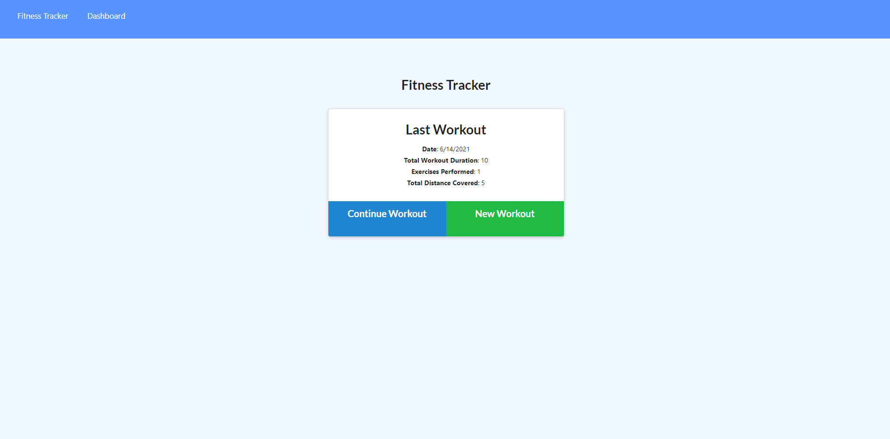
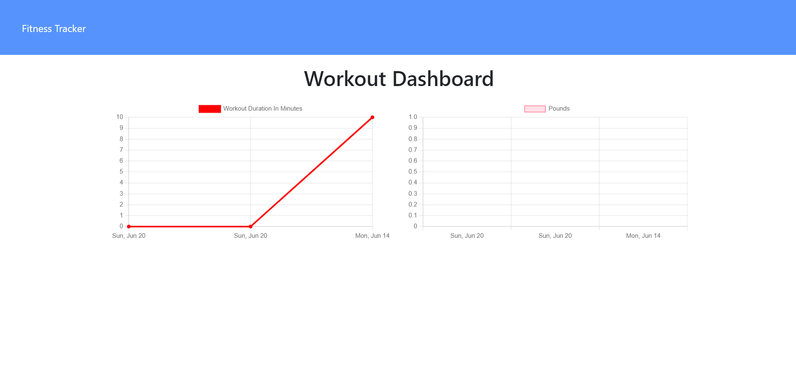

# Workout Tracker

It can be hard to track your workouts and what you have accomplished. This simple app will help you keep a record of what you have done and what you are doing in your workout adventure. 

Check it out the deployed link [here](https://workout-tracker-bootcamp2021.herokuapp.com/?id=60c7d72736fee300150b533f).

## Description

This application can tell you about your latest workout and help you track it. See the date of your last workout, how long the workout was, the excerises performed, and various other information. You can select between Resistance workouts and Cardio workouts.

This application will also track your workouts through a chart. See how much pounds you have lifted or how long you have worked out!

All information is saved onto a Mongo Database, so never worry about losing your progress again!

## Features
- User can create a new workout, and choose between Cardio and Resistance.
- User can see continue a previous workout that they started, or complete a workout when done.
- User can see charts of pounds lifted or duration of workouts on the Dashboard. 
- All progress is saved on a deployed database

